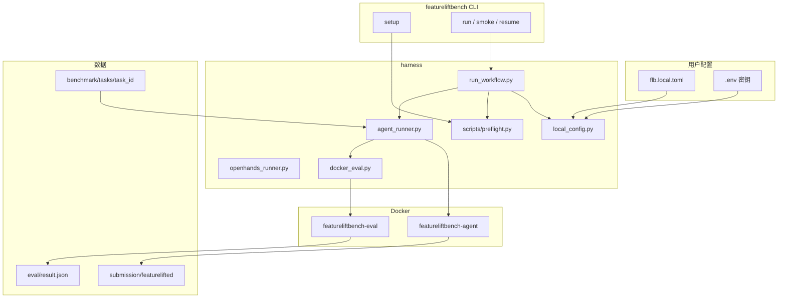

# 项目架构与实现

FeatureLiftBench 评测「能否从纠缠仓库中抽出一个独立、行为保持的 Python feature 包」。本文说明**当前仓库如何实现**整条链路。

---

## 1. 四层结构

```text
docs/              文档
benchmark/         数据集（题目、oracle、vendor wheels）
harness/           评测器 + Agent 编排 + CLI
experiments/       本地实验输出（gitignore）
```

Benchmark 定义**不依赖** Agent：可单独 `validate-task`、`eval`。

---

## 2. 端到端数据流（当前主线）



一次任务运行的顺序：

1. **加载配置**：`flb.local.toml` → `local_config.load_local_config()`；内存合成 OpenHands profile（`load_local_agent_config()`），无需手写 `openhands_qwen3_*` profile 名。
2. **运行时策略**：`resolve_runtime_policy()` 注入 Docker 网络、max_steps、API env（本地 vLLM 自动 `host` 网络）。
3. **Preflight**：Docker 镜像、API key、LLM health check（`preflight.py --local-config`）。
4. **Agent 阶段**（`agent_runner.run_agent_on_path`）：
   - 准备 task workspace（`benchmark/tasks/<id>/` 含 `repo/`、public tests、metadata）。
   - 在 **agent Docker** 内跑 OpenHands（`openhands_runner.py`），写 `agent/openhands_events.jsonl`、`usage.json`。
   - Agent 产出 `submission/featurelifted/`。
5. **Eval 阶段**（`docker_eval.evaluate_submission_docker`）：
   - 在 **eval Docker** 内跑 public + hidden tests，禁网、资源限制。
   - 写 `eval/result.json`（含 `docker_sandbox_error`、分数、footprint）。
6. **Suite 汇总**：多题写入 `suite.json`、失败分类、token 汇总；main 跑分析脚本（`analyze_*`、`summarize_suite_infra`）。

---

## 3. Suite 编排（`run_workflow.py`）

| suite | 实现 |
|-------|------|
| `smoke` | 单题 `benchmark/sanity/iniconfig__parse_config__001` → `check_openhands_smoke.py` |
| `sanity` | `benchmark/sanity` 三题 |
| `pilot5` | 两段：`sanity3/` + `batch2/`（指定 2 个 task_id）→ `merge_openhands_pilot.py` |
| `main` | `benchmark/tasks` 全量，**不与 smoke 合并** |
| `custom` | `flb.local.toml` `[run.custom]` |

Smoke 与 main **分两条命令**，避免进度条 `0/1` 误导为全量。

---

## 4. 核心模块

| 模块 | 路径 | 职责 |
|------|------|------|
| CLI | `harness/featureliftbench/cli.py` | `setup`、`run`、`smoke`、`resume`、`run-agent`、`eval` |
| 本地配置 | `local_config.py` | `flb.local.toml` 解析、suite preset、runtime policy |
| 工作流 | `run_workflow.py` | preflight → lock → 分 phase 跑 agent → 分析 |
| Agent 配置 | `agent_config.py` | `agents.toml` profile；与 local 合成二选一 |
| Agent 运行 | `agent_runner.py` | 单题/套件并发、resume、Rich 进度条 |
| OpenHands | `openhands_runner.py` | headless OpenHands、步数上限、日志解析 |
| Eval | `docker_eval.py`、`evaluator.py` | Docker 沙箱评测、打分 |
| 进度 UI | `suite_progress.py` | Rich Live（需 stderr TTY） |
| 路径 | `paths.py` | `TASKS_DIR`、`EXPERIMENTS_DIR` 等 |

### 关键脚本（`harness/scripts/`）

| 脚本 | 作用 |
|------|------|
| `preflight.py` | 环境/API/Docker/LLM 探活 |
| `check_openhands_smoke.py` | 冒烟通过条件（api_calls、eval 无 sandbox 错误） |
| `validate_suite_resume.py` | resume 前校验 artifact |
| `analyze_benchmark_suite.py` | 生成 `benchmark-analysis.md` |
| `summarize_suite_infra.py` | `infra_clean` 判定 |
| `merge_openhands_pilot.py` | pilot5 合并摘要 |

---

## 5. Docker 分工

| 镜像 | 内容 | 跑什么 |
|------|------|--------|
| `featureliftbench-agent:latest` | Python 3.12 + OpenHands | Agent 读题、改代码、写 submission |
| `featureliftbench-eval:latest` | 评测依赖 + vendor wheels | pytest、footprint、hidden tests |

Eval 容器以非 root、`--read-only`、资源上限运行；宿主机预创建 `eval/`、`logs/` 并 `chmod 777`，避免 bind mount 权限问题（见 `docker_eval._prepare_docker_eval_output`）。

---

## 6. Benchmark 目录

```text
benchmark/
  sanity/           3 题烟雾
  tasks/            ~100 题主榜
  staging/          候选题（晋级前）
  vendor-wheels/    离线 wheel（eval 镜像烘焙）
  submissions/      oracle（gitignore）
```

单题契约：`task.toml`、`metadata.json`、`repo/`、`tests/`、`hidden/` — 见 [TASK_FORMAT.md](TASK_FORMAT.md)。

Agent 可见：repo 快照 + public tests + 任务说明；hidden tests 仅 eval 使用。

---

## 7. 实验输出约定

```text
experiments/openhands-agent/<suite>-<timestamp>/
  run.meta.json
  .run.lock/          # 运行中持有
  suite.json
  <task_id>/run.json
```

`run.json` 含 agent 状态、evaluation、failure_class；suite 级汇总含 `agent_usage_totals`、`failure_classes`。

---

## 8. 与历史路径的区别

| 旧方式 | 现方式 |
|--------|--------|
| 多个 `export FEATURELIFTBENCH_*` | `flb.local.toml` + CLI 自动注入 |
| `AGENT_PROFILE=openhands_*` | 本地 profile 内存合成 |
| main 内嵌 smoke-first | `featureliftbench smoke` 与 `run --suite main` 分开 |
| `mini-swe-agent` 主线 | OpenHands 主线（内置上下文管理） |

---

## 9. 相关文档

- [RUN.md](../RUN.md) — 命令速查
- [README.md](../README.md) — 项目入口
- [docs/README.md](README.md) — 文档索引
- [BENCHMARK_SPEC.md](BENCHMARK_SPEC.md) — 评测契约
