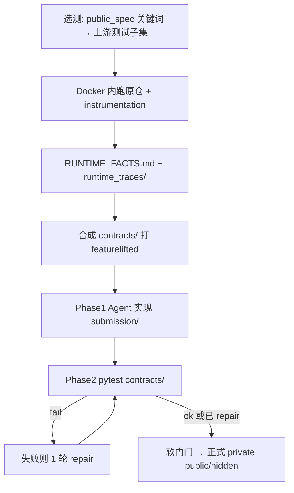

# Execution-Guided Contract（方法故事）

> **Documentation status: archived · Indexed: 2026-08-04**

**状态：** 设计落地 v1（2026-07-29）— 完全体已实现；12 题 Flash 试点进行中  
**定位：** FeatureLiftBench 上的方法研究假说与协议；**不是**已验证结论  
**上位：** [CURRENT_RESEARCH.md](../plans/CURRENT_RESEARCH.md) · [EVALUATION.md](../../EVALUATION.md) · [STATUS.md](../../STATUS.md)  
**对照方法：** [METHOD_TEST_DRIVEN_COGNITION.md](METHOD_TEST_DRIVEN_COGNITION.md)（已降级，不扩）  
**试点：** `experiments/exec_contract_pilot/`（当前 checkout 未保留该目录；路径仅作历史记录）  
**实现：** `harness/featureliftbench/exec_contract/` · 臂开关 `--arm exec_contract`

---

## 1. 一句话

原仓库是行为 ground truth：定向跑上游测试并 instrumentation → 把可观察事实写成 `RUNTIME_FACTS` 与打向 `featurelifted` 的可执行 `contracts/` → Agent 按事实提取 → 合约验证（可 1 轮修复）→ 再进入正式 private public/hidden（仍 **test-blind**）。

> **Execution-Guided Contract**  
> ——契约来自**已执行的上游行为**，不是 Agent 空想出来的探针。

---

## 2. 为什么换这条路（从 TD 学到的）

### 2.1 TD-Cognition 的结论（机制，非样本量吹嘘）

同题同模型（Flash · 12 题）：

| 臂 | Functional Pass | 备注 |
| --- | ---: | --- |
| Main | **4/12** | `compare-20260728-155516/main` |
| TD（干净） | **4/12** | `td-cognition-clean-20260728-220500`；相对 Main **零翻盘** |
| TD（脏） | 作废 | 宿主机无 pytest → gate 假阴性 |

门闩修好后 Phase1 `gate.ok` 可达 **9/12**，但 Pass 仍 = Main。对 **alembic / click** 等「gate✓、功能✗」题的尸检表明：

1. Agent **自编探针偏浅 / 偏错**（resolve-only、错误 short-circuit、漏 `invoke` 等）；  
2. Phase2 **忠实地采用了错误故事**，不是「没采用脚手架」；  
3. 「强制先发明测试」会**锁死错误认知**，代价高于 Main，收益为零。

**推论：** 缺的不是「先写测试」这个仪式，而是 **可信的行为真值**。真值应来自原仓已能跑通的行为，而不是模型编造。

### 2.2 诊断假说（仍待本臂验证）

FeatureLift 失败常落在 API/行为闭包：表面 API 像了，边界与隐藏约定（如 `base` 字面/符号、`ancestors` 是否含 self、`envvar→default_map`）不对。  
这些约定**写在代码与上游测试的交互里**，靠静态读或自写浅探针容易猜错；**跑一遍看得见的执行**更贴。

### 2.3 与相关工作的对齐（引用级，非照搬）

| 线索 | 对本臂的含义 |
| --- | --- |
| 执行轨迹驱动推理（Think Like You Execute 等） | 「看着程序怎么跑」比编 CoT 更可靠；但多为**训练侧**，我们短期不 fine-tune |
| Spec inference + runtime falsification（Code-Augur 类） | 更贴 **Agent 运行时脚手架**：假设 → 用执行证伪/确认 |
| Berkeley 等 executable specs | 可执行规格作验收锚点 |

本臂取的是 **runtime scaffold**：harness 强制「动手前消费环境给出的执行事实 + 合约」，不依赖训练数据。

---

## 3. 核心假说

### 3.1 H1（主假说）

在 FeatureLift Main 同可见性下，于首次实现前由 harness **定向执行上游相关测试并注入结构化运行时事实 + `featurelifted` 合约**，相对纯 ReAct Main，能提高 Functional Pass@1（或至少降低「契约读错」类失败）。

### 3.2 机制对比

| | Main | TD-Cognition | **Exec-Contract** |
| --- | --- | --- | --- |
| 行为真值来源 | Agent 自探 | Agent **自编**探针 | **原仓执行记录** |
| 动手前强制产物 | 无 | `COGNITION.md` + `probes/` | `RUNTIME_FACTS.md` + `contracts/` |
| 交卷前自验 | Agent 随意 | 探针（常测错故事） | **合约 pytest**（可 1 轮 repair） |
| benchmark public/hidden | 不可见 | 不可见 | **不可见** |
| 与 Main 差一刀 | — | 认知仪式 | **执行编排 + 合约门** |

## 禁止评测软泄漏

合约 **不得** 编码 benchmark `public_tests` / `hidden_tests` 的断言形态（含研究者看完 formal 失败后再手写的同构图 / 报错串）。  
允许：`public_spec`、上游 AST、定向上游执行 trace。  
违规跑（如按失败点调出的 v2c PASS）只作 oracle-scaffold 消融，见 `experiments/exec_contract_pilot/CONTAMINATED_LEAKY_SCENARIOS.md`。

另：

- **禁止**用 benchmark 测试文件直接生成合约（那是 Public-feedback 消融）。  
- **禁止**与 `td_cognition` 同开。  
- 不把本臂结果与 Public-feedback / oracle-scaffold 混成「Main 提升」。  
- 小样本只做机制判断，不宣称大样本证明。

---

## 4. 完全体协议



### Phase 0 — Collect & Synthesize（harness，Agent 动手前）

1. **选测**（`select_tests`）：用 `public_spec` 的 API/行为关键词匹配原仓测试路径；限文件数，避免全仓噪声。  
2. **执行 + 观测**（`collect` + `instrument`）：在 agent/eval 同款 Docker 中跑上游 pytest；`PYTHONPATH` 指向原仓可导入路径；清掉易炸的上游 `addopts`（xdist/cov）；可选 best-effort `pip install -e`。  
   - 观测：调用面、返回/异常摘要、环境相关事实等 → `runtime_traces/`。  
3. **叙事注入**（`workspace`）：写 `RUNTIME_FACTS.md`，并改 TASK/提示强调「以事实与合约为准」。  
4. **合约合成**（`synthesize`）：尽量映射到 `required_api` / 行为清单，生成可对 `featurelifted` 跑的 pytest：  
   - **surface**：符号/属性存在性；  
   - **replay**：能对齐的调用—结果（上游名与 featurelifted 名常对不齐 → 允许为空）；  
   - **behavior checklist**：可检查的浅层行为义务。

### Phase 1 — Extract（Agent）

与 Main 相同可见性：Full-Repository、No-Hint、test-blind。  
额外输入：`RUNTIME_FACTS.md` + `contracts/`。目标仍是独立 `submission/featurelifted/`。

### Phase 2 — Verify & Repair（harness）

1. `PYTHONPATH=submission` 跑 `contracts/`。  
2. **失败 → 最多 1 轮 repair**（把失败摘要注回 Agent）。  
3. **软门闩**：合约未过仍进入正式 evaluator（便于诊断；报告按 `contract_gate_ok` 分桶）。  
4. 审计落盘 `exec_contract_phase.json`（Phase0 质量、事件数、合约数、gate、repair）。

### 正式评测

不变：private public ∧ hidden ∧ build ∧ isolation → Functional Pass。  
合约过 ≠ 正式过；正式过才是 headline。

---

## 5. 实现地图

| 模块 | 职责 |
| --- | --- |
| `exec_contract/select_tests.py` | 定向选上游测试 |
| `exec_contract/instrument.py` | trace / 环境观测钩子 |
| `exec_contract/collect.py` | Docker 收集 RUNTIME |
| `exec_contract/synthesize.py` | 合成 `contracts/` + facts |
| `exec_contract/verify.py` | 对 submission 跑合约 |
| `exec_contract/workspace.py` | 注入工作区与提示 |
| `exec_contract/audit.py` | `exec_contract_phase.json` |
| `ablation.exec_contract` | 臂开关；与 `td_cognition` 互斥 |
| profile `openhands_deepseek_v4_flash_exec_contract` | Flash 试点默认 |

---

## 6. 实验与 go / no-go

### 6.1 当前试点

```bash
./run_experiment.sh --arm exec_contract \
  --task-file experiments/methods/td_cognition_pilot/task_ids.txt \
  --run-id exec-contract-$(date +%Y%m%d-%H%M%S) \
  --workers 1 --timeout 3600 --docker
```

- **模型：** `deepseek/deepseek-v4-flash`  
- **题集：** 与 TD 相同 12 题  
- **对照：** Flash Main **4/12**（同上 `compare-…/main`）  
- **操作：** `experiments/exec_contract_pilot/README.md`（当前 checkout 未保留）

### 6.2 看什么（先机制，再分数）

1. **Outcome：** Pass@1、相对 Main 的 flip 集合。  
2. **Phase0 质量：** `trace_quality`、pytest 是否真过、合约条数（replay 常为 0 不单独判死刑）。  
3. **传导：** `contract_gate_ok` 与正式 Pass 的交叉表；尤其 alembic / click 是否从「读错契约」里救出。  
4. **代价：** 墙钟、repair 触发率。

### 6.3 Go / No-go（建议阈值）

| 结果 | 动作 |
| --- | --- |
| 相对 Main **稳定 +≥2** 且 flip 落在契约类题 | 保留为方法主候选；可加 falsify 环或扩样本 |
| ±0～1 或仅噪声翻盘 | 停扩；改选测/合成，或承认「执行喂事实」不足 |
| Pass 降且 Phase0 常失败 | 先修 collect/bootstrap，再谈方法 |

---

## 7. 已知风险与边界

1. **选测偏差：** 关键词没命中关键上游测 → 事实空洞。  
2. **映射缝隙：** 上游 `import alembic` ≠ `featurelifted`；replay 常空，只能靠 surface + 叙事事实。  
3. **噪声与成本：** 单文件测太多（如 click 一次数百用例）会顶满 event 上限。  
4. **合约≠hidden：** 合约再绿也可能漏 hidden 边界；软门闩故意保留「合约过、正式挂」的诊断桶。  
5. **不替代 Public-feedback：** 若只为抬这 12 分，露出官方 public 通常更猛，但是**另一臂**，不能冒充 test-blind Main。

---

## 8. 文档与结果索引

| 文档 / 产物 | 用途 |
| --- | --- |
| 本文 | 方法故事与完全体协议 |
| [EVALUATION.md](../../EVALUATION.md) | 当前实验臂定义 |
| [METHOD_TEST_DRIVEN_COGNITION.md](METHOD_TEST_DRIVEN_COGNITION.md) | 为何换路（负对照） |
| `experiments/exec_contract_pilot/` | 跑法与当前 run-id |
| 每题 `exec_contract_phase.json` | 审计 |
| `experiments/methods/ablation/exec-contract-*` | 原始结果目录 |

---

## 9. 变更记录

| 日期 | 变更 |
| --- | --- |
| 2026-07-29 | 完全体落地：collect→synthesize→agent→verify(+1 repair)→软门闩→正式 eval；启动 Flash×12 试点 |
| 2026-07-29 | 由 TD 尸检结论驱动：弃「自编探针先行」，改「原仓执行事实先行」 |
| 2026-07-29 | **v1 断链：** `exec-contract-20260729-132300` 作废（假绿合约）。修复：选测≤5、装上游依赖、path-only watch、禁 `assert True`、上游 AST 推断方法（含 `invoke`）、场景真断言、`contract_gate_ok` 要求 `contracts_substantive` |
| 2026-07-29 | **评测软泄漏纠正：** 删除按 formal 失败点手写的同构场景（报错串 / heads 顺序 / 依赖图等）。v2c PASS 降级为 oracle-scaffold 消融，不作主结果。场景仅保留上游 AST + public_spec 义务 |
| 2026-07-30 | Focus：clean3 仍为最佳干净模板（两题 p✓ h✗）；clean4 / self_contract 均在 alembic 上因 `"base"` 过度泛化回退。Self-Authored 见 [METHOD_SELF_CONTRACT.md](METHOD_SELF_CONTRACT.md) |
