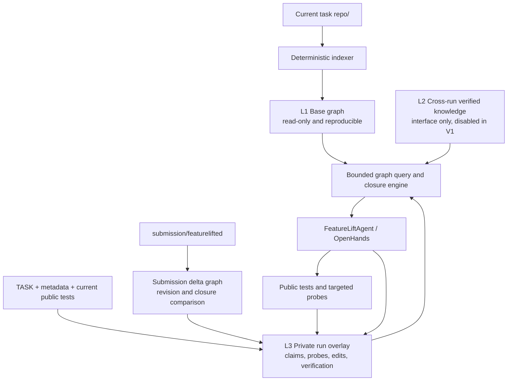

# Repository Semantic Graph 最终设计

- 状态：Final Design v1.1（OpenHands transport amendment）
- 更新时间：2026-07-23
- 适用范围：FeatureLiftBench Python 主 benchmark 与 FeatureLiftAgent 机制实验

## 0. 冻结结论

结合 550-run 失败归因、Python-150 仓库规模和现有 Agent runner，V1 冻结为以下方案：

| 决策面 | 最终选择 |
| --- | --- |
| 模块定位 | Agent 无关的 Repository Semantic Graph（RSG）数据与工具层，不负责生成 patch |
| 论文方法关系 | RSG 提供 artifact/dependency/risk/evidence；ECSM 负责 expand、probe、prune、stop |
| 主要目标 | 解决定位之后的 dependency/API/behavior closure，而不是继续优化文件定位 |
| 基础图 | 仅从当前任务的 `repo/` 构建，只读、确定性、symbol-level |
| 任务信息 | TASK、metadata behavior、当前 public tests 只进入当前 run 私有 overlay |
| 提交状态 | 为 `submission/featurelifted` 构建轻量增量图，用于 source-to-submission closure 对照和 freshness |
| 跨任务记忆 | L2 接口保留，但 V1 和第一轮因果实验关闭 |
| 存储 | JSONL 权威快照 + Python 内存邻接表；当前规模不使用 SQLite/图数据库 |
| 解析 | Tree-sitter 统一语法前端 + per-language query/adapter/resolver；无法确定的关系保留 candidate/unresolved |
| 交互 | 统一有界 JSON 协议；CLI 为跨 Agent 基线，OpenHands 可使用 run-local native-tool adapter；FeatureLiftAgent 使用同协议 Python API |
| Agent 接入 | runner 统一初始化和注入；OpenHands、mini-swe-agent 不修改上游核心代码 |
| 初始暴露 | runner 自动生成并注入固定预算 bootstrap；后续查询由 Agent 决定 |
| 证据 | claim、runtime evidence、revision、source hash 和 invalidation 独立于对话摘要保存 |
| 失败策略 | graph arm 在第一次模型调用前初始化、自检并 fail-fast，不允许静默退化 |
| 第一轮实验 | 先验证 static skeleton、task closure、evidence/freshness 三个增量，不测试共享长期记忆 |

RSG 的跨 Agent 能力与 ECSM 的强制控制能力必须分开表述：

- OpenHands 和 mini-swe-agent 可以获得相同 bootstrap、CLI 查询、claim/evidence 写入和 post-run audit；
- 当前 subprocess runner 无法强制这两个 Agent 在每次修改后调用同步或满足 stopping guard；
- FeatureLiftAgent 可以通过原生 Python API 强制 revision、freshness 和 stopping transition；
- 因此跨 Agent 实验测量的是 **RSG tool augmentation**，强制状态机实验测量的是 **RSG-backed ECSM**，两者不能合并成一个实验 arm。

2026-07-23 的 OpenHands clean1 付费门控表明：CLI 可执行不代表模型会采用。
P3 只调用了 final `submission-check`，没有调用 initial `task-closure`。因此
设计允许增加一个 run-local OpenHands native-tool transport，仅把现有两个
有界命令注册为模型可见工具；它不得增加图数据、改变返回 schema、自动替
Agent 做决策，或与 FeatureLiftAgent 的 online enforcement 混为一谈。

## 1. 一句话定义

Repository Semantic Graph（RSG）是 Agent 的仓库外部骨架：它用确定性静态图描述代码仓库的结构，用任务私有 overlay 维护功能闭包假设、运行时证据和验证状态，并通过有界查询向 Agent 暴露与当前决策相关的子图。

RSG 的目标不是把仓库全文换一种格式保存，也不是把完整图塞进上下文，而是让 Agent 更快回答五个问题：

1. 目标行为从哪些入口进入？
2. 为保留该行为，哪些符号、类型、资源和状态是必要的？
3. 哪些依赖只在运行时暴露？
4. 哪些原仓库耦合应该复制、替代或排除？
5. 当前还有哪些高风险结论没有证据？

## 2. 设计动机与证据

当前 550-run 失败归因中，Agent-attributable failures 主要集中在定位之后：

| 最早失败阶段 | 数量 |
| --- | ---: |
| dependency discovery | 85 |
| implementation | 80 |
| dynamic semantics | 43 |
| budget exhaustion | 32 |
| boundary recovery | 15 |
| localization | 5 |
| verification | 2 |

523/550 条轨迹已经观察到正确入口，说明 FeatureLiftBench 的主要问题不是文件检索本身。RSG 因此不能只做 Repo Map 或符号搜索；它必须把重点放在依赖闭包、动态风险、抽取边界和证据 freshness 上。

范围选择还受以下结果约束：

- 401/550 public pass，但只有 228/550 hidden pass；最大直接损失发生在 public→hidden，支持优先建模 API、资源、状态和行为闭包；
- 动态任务和相对静态任务的总体 pass 与 public→hidden gap 接近，现有数据不能证明“完整动态分析器”是首要解；V1 只做风险触发式 detector 和 probe suggestion；
- 严格 memory-state-management 候选只有 2 条，跨任务长期记忆不是 V1 的 pass 主张；
- 98.65% verified tokens 是 prompt，且失败轨迹消耗 63.72% tokens，因此所有图输出必须有硬预算，不能用完整图替代文件历史；
- resource、framework 和 third-party coupling 的描述性通过率较低，因此 resource/package-data、registry、optional dependency 和 forbidden-boundary 信号优先于完整反射解析。

本设计与 ECSM 的关系是：

- RSG 保存 repository artifact、dependency、claim 和 evidence；
- ECSM 保存当前任务的 obligation 状态并决定 expand、probe、prune 或 stop；
- RSG 是可查询的长期结构，ECSM 是消耗该结构的决策控制器；
- 两者可以独立消融，避免把静态索引收益误认为 ECSM 收益。

## 3. 目标与非目标

### 3.1 目标

- 为每个上游 source snapshot 生成可复现的 symbol-level 仓库骨架；
- 用有界子图查询代替无目标的全仓库读取；
- 显式表示全局状态、配置、资源、注册和动态调用风险；
- 为任务建立 required、replaceable、incidental、unresolved 闭包状态；
- 保存 claim 的来源、可信度、适用范围和失效条件；
- 将静态事实、Agent 假设和运行时观察严格分离；
- 保证不同 benchmark run 之间没有 hidden/evaluator 信息泄漏；
- 记录所有图查询和写入，支持论文审计与消融。

### 3.2 非目标

- 不保存每个 AST expression 或 statement；
- 不在图中复制完整源码、资源正文或完整测试输出；
- 不把 LLM 自由文本摘要视为确定性事实；
- V1 不做跨 Agent 的共享在线写入；
- V1 不引入 Neo4j、向量数据库或独立图服务；
- 不允许 hidden tests 或 evaluator 输出进入共享仓库记忆。

## 4. 核心设计原则

### 4.1 决策增益优先

一条信息只有在能够改变 inspect、include、replace、probe、verify 或 stop 决策时才应进入图。可以计算、但不会改变决策的派生信息不作为权威数据保存。

### 4.2 确定性事实与不确定性分离

AST 提取的 `DEFINES` 与 Agent 推断的 `REQUIRED_FOR_BEHAVIOR` 不能使用相同的可信语义。基础图只包含可从公开源码重建的事实；推断、观察和验证进入 overlay。

### 4.3 图是索引，不是上下文

Agent 永远不接收完整图。查询接口返回限定节点数、边数和字符数的任务子图，并记录哪些内容实际进入模型上下文。

### 4.4 不确定性是一等对象

`unresolved dynamic dispatch`、`resource packaging unknown` 和 `state lifetime unknown` 不是图构建失败，而是应驱动 runtime probe 的显式风险。

### 4.5 基础图不可变，overlay 追加写

同一个 `(source, commit, source_tree_hash, builder_version, schema_version)` 对应一个不可变基础快照。每个任务 run 拥有自己的 append-only claim/evidence overlay。源码变化生成新快照或触发相关 claim 失效。

## 5. 三层模型



### 5.1 L1：确定性基础图

输入只包括当前任务 `repo/` 中的源码、配置和资源元数据。TASK、FeatureLiftBench behavior metadata、public tests、hidden tests、evaluation 和其他任务内容都不进入 L1。L1 可以从相同 source snapshot 重建，不接受 Agent 写入。

### 5.2 L2：验证后的仓库语义知识

L2 是后续研究能力，V1 不读取、不写入，也不进入第一轮因果实验。未来只有与特定任务 outcome 无关、能由公开源码或公开 probe 独立验证的结论才允许晋升。任何 hidden test、evaluator 反馈、reference solution 或其他 run 的解题结果都不得进入 L2。

### 5.3 L3：当前任务私有 overlay

L3 从当前 TASK、metadata、public tests 和 run observations 初始化，保存行为 obligations、候选闭包、Agent 假设、runtime evidence、submission delta 和 freshness。L3 随 run 归档，不跨 run 读取。

## 6. V1 图模式

Tree-sitter 只负责生成容错 CST 和 query captures。每种语言通过 `LanguageAdapter` 将 definition/import/call/state/resource cue 归一化为通用 IR，通过 `LanguageResolver` 处理跨文件绑定。Tree-sitter 不自动提供调用图、类型绑定或动态语义；resolver 无法确定的关系必须降级为 probable/candidate/unresolved。

V1 完整实现 Python adapter，并实现最小 Go adapter/fixtures 验证 IR 可移植性。Python 标准库 `ast` 仅用于离线差分审计，不写入正式 graph。

### 6.1 节点类型

| 类型 | 作用 |
| --- | --- |
| `repository` | source 与 commit 根节点 |
| `package` / `module` / `file` | 代码组织结构 |
| `class` / `function` / `method` | symbol-level 行为单元 |
| `global_state` | 模块变量、singleton、cache、registry |
| `public_api` / `entrypoint` | 面向任务和用户的入口 |
| `third_party_dependency` | 外部依赖与 optional dependency |
| `resource` | package data、模板、schema、数据文件 |
| `config` / `environment_variable` | 环境和生成配置 |
| `test` | public test 或 Agent 自建 probe |
| `behavior` | 当前任务要求保留的行为，属于 L3 |
| `submission_artifact` | 当前抽取实现中的 symbol/resource 映射，属于 L3 |

V1 不创建 expression、statement 和 local-variable 节点。局部细节通过 symbol 的 source span 回到源码读取。

Claim 和 runtime evidence 使用独立 ledger record 保存，通过 subject、artifact 和 evidence ID 投影为 overlay 边，不混入 L1 节点表。

### 6.2 稳定身份

跨构建稳定 ID 不使用递增序号或行号，而使用：

```text
<language>:<namespace>:<lexical-qualified-name>:<kind>[:<definition-ordinal>]
```

例如 `python:tomlkit.parser:Parser.parse:function`。行号、signature hash、source hash 和 commit 是属性；JSONL 内部可以同时保存紧凑整数 ID。条件定义或同一 lexical scope 中的重名定义使用 definition ordinal 消歧。

### 6.3 基础结构边

```text
CONTAINS
DEFINES
IMPORTS_SYMBOL
CALLS
INHERITS
INSTANTIATES
ACCEPTS_TYPE
RETURNS_TYPE
REFERENCES
TESTS
DEPENDS_ON_PACKAGE
```

所有解析出的边必须标记 `resolution=exact|probable|candidate|unresolved`、provenance 和 source location。只有 `exact` 可以作为确定性闭包边；其他状态只能形成候选、风险或 probe target。

### 6.4 动态风险与环境边

```text
READS_GLOBAL
WRITES_GLOBAL
MUTATES_ARGUMENT
INITIALIZED_AT_IMPORT
REGISTERS
REGISTERED_BY
DECORATED_BY
DYNAMIC_IMPORT
DYNAMIC_GETATTR
DYNAMIC_DISPATCH
CALLBACK_TO
READS_ENV
DEPENDS_ON_CWD
READS_CONFIG
LOADS_RESOURCE
REQUIRES_PACKAGE_DATA
LAZY_LOADED_BY
```

无法确定目标的动态边必须保留表达式、位置和候选集合，并标记 `resolution=unresolved`，不能伪装成确定的 `CALLS`。

### 6.5 任务闭包边

```text
ENTRYPOINT_FOR
REQUIRED_FOR_BEHAVIOR
OPTIONAL_FOR_BEHAVIOR
REPLACEABLE_FOR_BEHAVIOR
INCIDENTAL_TO_BEHAVIOR
UNRESOLVED_FOR_BEHAVIOR
SUPPORTS
CONTRADICTS
INVALIDATED_BY
```

`REQUIRED`、`REPLACEABLE` 和 `INCIDENTAL` 是任务相关判断，只能存在于 L3，不得写入通用基础图。

## 7. 数据记录

### 7.1 节点

```json
{
  "id": 182,
  "stable_id": "python:tomlkit.parser:Parser.parse:function",
  "kind": "function",
  "qualified_name": "tomlkit.parser.Parser.parse",
  "path": "tomlkit/parser.py",
  "start_line": 81,
  "end_line": 113,
  "signature": "parse(self) -> Document",
  "exported": true,
  "source_hash": "sha256:..."
}
```

图中不保存完整源码。需要实现细节时，Agent 根据 path 和 span 使用原有文件读取工具。

### 7.2 静态边

```json
{
  "src": 182,
  "dst": 237,
  "kind": "CALLS",
  "provenance": {
    "source": "tree_sitter_query",
    "path": "tomlkit/parser.py",
    "line": 94
  },
  "resolution": "exact"
}
```

### 7.3 Claim

```json
{
  "claim_id": "claim_0182",
  "subject": 182,
  "predicate": "DEPENDS_ON_STATE",
  "object": 251,
  "status": "observed",
  "confidence": 0.85,
  "scope": {
    "source_commit": "abc123",
    "python": "3.11",
    "platform": "linux"
  },
  "provenance": ["evidence_0031"],
  "depends_on_source_hashes": ["sha256:..."],
  "created_by_run": "run_..."
}
```

Claim 状态机：

```text
hypothesis -> observed -> verified
     |            |          |
     +------------+----------+-> contradicted
                              -> stale
```

### 7.4 Runtime evidence

```json
{
  "evidence_id": "evidence_0031",
  "kind": "runtime_probe",
  "probe_type": "repeated_call_state",
  "command_hash": "sha256:...",
  "input_summary": "parse the same document twice with one parser instance",
  "result_summary": "second result depends on retained parser state",
  "result_hash": "sha256:...",
  "status": "supports",
  "affected_symbols": [182, 251],
  "environment": {
    "python": "3.11",
    "cwd_class": "repository_root"
  }
}
```

完整 stdout/stderr 继续保存在 run audit log 中；图只保存有界摘要与 hash。

## 8. 存储与运行时表示

### 8.1 当前 benchmark 规模

对 `benchmark/tasks/*/repo` 的 150 个 Python 主任务测量如下：

| 指标 | 中位数 | P90 | P95 | 最大 |
| --- | ---: | ---: | ---: | ---: |
| 仓库大小 | 176 KB | 3.97 MB | 5.52 MB | 28.51 MB |
| 总文件数 | 22 | 135 | 404 | 828 |
| Python 文件数 | 16 | 96 | 172 | 726 |
| Python LOC | 4,429 | 29,128 | 46,593 | 349,741 |
| 类/函数定义数 | 253 | 1,822 | 2,653 | 6,175 |
| 调用点数量 | 835 | 6,156 | 11,121 | 22,699 |

150 个任务对应 121 个上游项目和 126 个唯一 `(source, commit)` 快照。当前规模不需要数据库服务或磁盘随机查询。

### 8.2 V1 决策

权威存储使用可审计 JSONL，运行时使用内存邻接表：

```text
artifacts/repository_indexes/
└── <source>/<commit>/
    └── <source-tree-hash>/
        └── <builder-version>/
            ├── manifest.json
            ├── nodes.jsonl
            ├── edges.jsonl
            └── static_risks.jsonl

agent_output/state/
└── repo_graph/
    ├── base/
    │   ├── manifest.json
    │   ├── nodes.jsonl
    │   └── edges.jsonl
    ├── task_manifest.json
    ├── task_subgraph.json
    ├── closure_overlay.json
    ├── submission_delta.jsonl
    ├── semantic_claims.jsonl
    ├── runtime_evidence.jsonl
    └── graph_queries.jsonl
```

内存索引：

```python
nodes_by_id: dict[int, Node]
symbols_by_name: dict[str, list[int]]
symbols_by_file: dict[str, list[int]]
outgoing_edges: dict[int, list[Edge]]
incoming_edges: dict[int, list[Edge]]
claims_by_subject: dict[int, list[Claim]]
```

可删除的 MessagePack 缓存可以在加载性能成为问题后增加。SQLite 只在单仓库达到几十万节点、需要部分加载或出现共享并发写入时考虑。存储后端必须由接口隔离，不能泄漏到图模型和查询 API。

全局 cache 不直接挂载给 Agent。runner 将当前 run 所需的基础快照物化到 `agent_output/state/repo_graph/base/`，这样现有 Docker 已有的 `/flb/agent:rw` 挂载即可覆盖 OpenHands 和 mini-swe-agent，不需要增加新的宿主机目录权限。base manifest 在启动前和结束后都校验 hash；实验审计把任何直接改写 base 的行为标记为 protocol violation。

## 9. 构建流水线

```text
discover files
  -> hash source snapshot
  -> parse modules and symbols
  -> resolve imports and calls
  -> detect state/config/resource/dynamic-risk cues
  -> validate referential integrity
  -> freeze manifest and JSONL snapshot
```

V1 使用 Tree-sitter 作为统一解析前端。parser core、grammar、query pack、language adapter 和 resolver 的版本/hash 都进入 builder identity。基础图构建器必须：

- 排除 `.git`、venv、cache 和 evaluator 私有目录；
- 保留项目源码、配置和 package resource 元数据，不扫描 FeatureLiftBench public/hidden/evaluation 目录；
- 对每个节点生成稳定 ID；
- 对无法解析的引用显式标记 unresolved；
- 输出 node/edge 计数、解析失败和 source hash；
- 同一 `(source, commit, source_tree_hash, builder_version, schema_version)` 只构建一次。

Python adapter 的开发期质量门使用标准库 `ast` 做 definitions/imports/source-entrypoint 差分审计，但 AST 结果不与 Tree-sitter graph 合并。Go adapter 第一阶段只覆盖 package/function/type/interface/import/call/receiver method，后续语义 type checker 作为独立 resolver 扩展。

### 9.1 两阶段初始化

**阶段 A：source snapshot 初始化。** suite preflight 按 `(source, commit, source_tree_hash, builder_version, schema_version)` 解析或命中共享 cache。并行 worker 使用文件锁与临时目录构建，校验成功后原子发布。正式实验优先 prewarm 全部所需 snapshot，并同时记录 cold-build cost。

**阶段 B：run 初始化。** `prepare_agent_workspace` 完成后、创建 Agent subprocess 前，runner：

1. 将当前基础快照物化到 run-local base；
2. 从当前 TASK、metadata entrypoints/included behaviors 和 public tests 创建 L3；
3. 将 entrypoint 映射到稳定 symbol ID，未匹配项显式保留 unresolved；
4. 创建空 submission delta 和 revision 0；
5. 自动执行 bounded bootstrap，生成不超过 30 nodes / 6,000 chars 的初始摘要；
6. 生成 Agent 无关的 tool contract 文本和环境变量；
7. 执行 `self-check`、输入路径审计和 manifest hash 校验；
8. 只有全部成功后才启动 Agent 的第一次模型调用。

如果 profile 声明启用 RSG，任何一步失败都以 `repo_graph_initialization_failed` 结束；不得静默退化为 baseline。

## 10. Agent 查询接口

V1 提供最少但决策相关的工具：

```text
bootstrap()
search_symbol(query, kinds?, limit?)
get_symbol(symbol_id)
get_neighborhood(symbol_id, depth, edge_types, max_nodes)
find_dependency_paths(source_id, target_id, max_depth, max_paths)
draft_closure(entrypoint_ids, max_nodes, edge_policy)
get_dynamic_risks(symbol_ids, limit)
get_unresolved_claims(subgraph_id, limit)
record_claim(claim)
record_evidence(evidence)
update_claim_status(claim_id, status, evidence_ids)
explain_dependency_path(path_id)
sync_submission()
compare_source_submission(behavior_ids?)
self_check()
```

统一 CLI 映射为 `flb-rsg bootstrap|search|inspect|paths|closure|risks|claim|evidence|sync-submission|compare|self-check`，输出与 Python API 使用相同 JSON schema。Agent 不直接编辑 JSONL。

每次查询必须记录：

- run、phase、query type 和参数 hash；
- 返回节点/边/字符数；
- 是否截断；
- 查询耗时；
- 返回结果 hash；
- 后续是否读取了相关源码、运行 probe 或纳入闭包。

冻结的默认输出预算：

| 操作 | 上限 |
| --- | ---: |
| bootstrap | 30 nodes / 6,000 chars |
| neighborhood | depth 2 / 100 nodes |
| dependency paths | depth 4 / 5 paths |
| closure | 100 nodes / 12,000 chars |
| risks | 20 risks / 8,000 chars |
| 任意单次输出 | 12,000 chars |

截断结果必须返回 `truncated`、省略数量和 continuation token。Agent 必须通过 follow-up query 扩张，而不是一次性拉取完整图。

### 10.1 可插拔交互层级

| 层级 | 能力 | OpenHands / mini-swe-agent | FeatureLiftAgent |
| --- | --- | --- | --- |
| bootstrap | runner 注入固定初始摘要 | 支持 | 支持 |
| query | CLI 或 run-local native tool 读取有界子图 | 支持 | Python API |
| overlay | CLI 写 claim/evidence/submission revision | 支持但依赖 Agent 调用 | 原生调用 |
| enforcement | 强制 mutation 后失效、stopping guard | 当前 runner 不支持 | 支持 |

所有 Agent 使用同一个 protocol schema；差异只存在于 transport 和是否能
强制控制。run-local OpenHands native-tool adapter 只能包装现有
`task-closure` 与 `submission-check`，不能改变返回内容或实验能力；通用
MCP/HTTP 服务仍不属于 V1。

## 11. 闭包规划

### 11.1 初始种子

从任务元数据的 `feature.source_entrypoints`、输出 API 和 included behaviors 构建 behavior 与 entrypoint 节点。找不到精确符号时才使用名称、import 和文件搜索回退。

### 11.2 扩张优先级

建议优先顺序：

1. API signature、data model、inheritance；
2. resolved calls 与 imported symbols；
3. global state、registry、resource、config、environment；
4. unresolved dynamic dispatch 与 optional dependency；
5. 与目标行为无直接路径的普通引用。

### 11.3 闭包状态

每个候选 artifact 必须被分类为：

```text
required
replaceable
incidental
optional
unresolved
excluded
```

静态规则只负责创建候选、exact dependency 和 risk，不直接宣告任务必要性。`required`、`replaceable`、`incidental` 和 `excluded` 必须由 Agent/ECSM 写入 claim，并绑定 task behavior 与依据。进入实现阶段前，不要求所有节点 resolved，但所有高风险 unresolved 项必须具有 probe、保守实现或明确接受风险三者之一。

### 11.4 Probe 选择

图不直接断言所有动态行为。风险节点用于生成有界 probe：

- global read/write -> repeated call 或 fresh-instance probe；
- import initialization -> import-order probe；
- registry/plugin -> registry population probe；
- environment/CWD -> controlled environment probe；
- package resource -> clean-install resource lookup；
- dynamic dispatch -> representative runtime trace；
- type coercion -> boundary value and alternate type probe。

## 12. Freshness 与失效

source base 在 run 内不可变；freshness 主要由 submission revision 驱动。`sync-submission` 对 `submission/featurelifted` 重新计算轻量 symbol/import/resource 图；任何内容 hash 变化都递增 revision。之后执行以下规则：

1. 找到受影响的 file/symbol 节点；
2. 将依赖其 source hash 的 claim 标为 `stale`；
3. 将覆盖这些符号的旧测试结论标为不新鲜；
4. 重新计算受影响 behavior 的 unresolved risk；
5. fresh final verification 通过后才能恢复 verified 状态。

失效范围应通过反向依赖图有界传播，不能因为修改一个叶子函数而使整个仓库所有知识失效。

Claim 状态冻结为：

| 状态 | 最低条件 |
| --- | --- |
| `hypothesis` | Agent 推断，无执行证据 |
| `observed` | 当前 revision 上至少一个公开 probe 支持 |
| `verified` | 当前 revision 上有两类独立证据，例如 static+runtime 或 targeted+public/isolation |
| `contradicted` | 当前适用范围内存在直接反证 |
| `stale` | 依赖的 source/submission hash、环境或 revision 已变化 |

对 OpenHands/mini-swe-agent，runner 在 Agent 退出后强制执行一次 post-run `sync-submission` 和 freshness audit，用于测量但不能追溯改变 Agent 决策；对 FeatureLiftAgent，controller 在每次 mutation 后原生执行同步并阻止 stale evidence 通过 stopping guard。

## 13. 与现有实现的接入点

RSG 在 runner 层初始化，不放进某个 Agent 的私有实现。当前 `AgentAdapter` 已统一管理 mini-swe-agent、OpenHands、FeatureLiftAgent 和 custom command；RSG setup 应发生在 `prepare_agent_workspace` 之后、`adapter.run` 或 `run_agent_in_docker` 之前。

V1 不修改 OpenHands 或 mini-swe-agent 上游包：

- `featureliftbench.repo_graph.cli` 随现有只读 harness 挂载进入 Docker；
- run-local graph 随现有 `/flb/agent:rw` 挂载进入 Docker；
- runner 为不同环境解析宿主机路径或 `/flb/agent/state/repo_graph`；
- OpenHands 和 mini-swe-agent 收到同一份 bootstrap 与 CLI contract；
- FeatureLiftAgent 使用同一 protocol 的 in-process API，避免重复序列化。

配置项冻结为：

```toml
repo_graph_mode = "disabled"       # disabled | static | closure | evidence
repo_graph_transport = "cli"       # cli | inprocess
repo_graph_fail_fast = true
repo_graph_bootstrap_max_nodes = 30
repo_graph_query_max_chars = 12000
```

`disabled` 不生成 graph 文件、不注入工具说明、不设置环境变量，保证旧 profile 和冻结实验行为不变。`static` 只读 L1；`closure` 增加 task overlay 和 submission comparison；`evidence` 再增加 claim、probe evidence 和 invalidation。

当前 `FeatureLiftAgent` 已有适合演进的持久状态协议：

- `repo_map.md`：V1 中替换为 bounded task subgraph 摘要，而非删除文本回退；
- `source_entrypoints.json`：用于锚定初始 symbol 节点；
- `closure_plan.md`：改为由 closure overlay 渲染的人类可读视图；
- `dependency_manifest.json`：承载 required/replaceable artifacts 的导出结果；
- `tool_observations.jsonl`：作为 runtime evidence 的原始来源；
- `context_audit.jsonl` 与 `usage.json`：增加 graph query 与 graph-context token 统计。

建议新增模块：

```text
harness/featureliftbench/repo_graph/
├── models.py
├── builder.py
├── risk_detectors.py
├── jsonl_store.py
├── memory_index.py
├── query.py
├── closure.py
├── overlay.py
├── invalidation.py
├── protocol.py
└── cli.py
```

## 14. 实验隔离与泄漏控制

- L1 只能读取当前任务 `repo/`；
- 当前 TASK、metadata behavior 和 public tests 只能进入当前 run 的 L3；
- hidden tests、evaluation、reference solution 在图构建容器中不可见；
- L3 路径必须位于当前 run 的 `agent_output/state`；
- 默认实验不得从先前 run 加载 L2；
- 启用 L2 的研究 arm 必须使用预先冻结、outcome-blind 的共享快照；
- 每个 suite 保存 graph manifest、builder version 和 snapshot hash；
- tool query 输出计入 Agent prompt token；cold build、warm load、RSS、graph bytes 与 cache hit 单独报告；
- post-run 校验 base manifest，检测 Agent 绕过工具直接改写 graph snapshot 的 protocol violation；
- 图构建失败时 graph arm 必须 fail-fast，不允许静默退化为无图 baseline。

## 15. 评估与因果消融

### 15.1 实验 arms

跨 Agent plug-in 实验只比较工具增强，不声称强制状态机：

| Arm | 能力 |
| --- | --- |
| P0 | 当前冻结 Agent，无 RSG |
| P1 | 固定预算 bootstrap 文本，无后续图查询；控制“额外初始信息” |
| P2 | P1 + L1 static graph CLI 查询 |
| P3 | P2 + task closure overlay + submission comparison |
| P4 | P3 + claim/evidence/freshness advisory tool |

原生控制实验独立比较：

| Arm | 能力 |
| --- | --- |
| N0 | FeatureLiftAgent/ECSM controller，无 RSG augmentation |
| N1 | RSG-backed ECSM，强制 revision、invalidation、probe evidence 和 stopping guard |

P4 与 N1 不能直接归因于同一机制；P4 测可插拔工具增益，N1 测可执行状态控制增益。

模型、上下文窗口、token guard、工具、任务、seed 和 evaluator 必须冻结。不得将 graph arm 同时更换为新的模型或不同预算。

### 15.2 主要指标

- formal pass rate；
- public-pass-hidden-fail rate；
- dependency-discovery、dynamic-semantics 和 boundary failures；
- gold closure requirement recall（仅用于离线评价，不暴露给 Agent）；
- median verified tokens 与 prompt tokens；
- 源码读取次数、重复读取和 graph query 数；
- runtime probe precision：执行的 probe 中产生新闭包证据的比例；
- fresh final verification rate；
- stale/incorrect memory 导致的负迁移。

### 15.3 预期与可证伪结果

- L1 的首要预期是减少探索成本，不预设能大幅提高 pass；
- closure overlay 应主要影响 dependency-discovery 和 boundary failures；
- runtime evidence 应主要影响被风险检测器命中的动态任务；
- 如果 L1 只减少少量读取且不改善 token 或 pass，则不继续扩大静态图复杂度；
- 如果 claims 带来明显负迁移，必须先完善 evidence 和 invalidation，而不是增加共享记忆规模。

## 16. 分阶段实现

### Phase 0：模式与离线审计

- 冻结 Tree-sitter core、Python/Go grammar 和 query API 版本；
- 定义 language-neutral IR、adapter/resolver protocol 与 capability manifest；
- 冻结 node、edge、claim、evidence schema；
- 对 Python-150 生成规模报告；
- 建立 referential-integrity、determinism 和 no-private-path 测试。

### Phase 1：静态骨架与查询

- 实现 Tree-sitter backend、Python query pack/resolver 和最小 Go portability adapter；
- 对 Python-150 执行 Tree-sitter vs AST 离线差分审计；
- 实现 JSONL 快照和内存邻接表；
- 提供 bootstrap、search、neighborhood、path、draft-closure 和 self-check；
- 对同一 source commit 验证重复构建 hash 一致。

### Phase 2：任务闭包 overlay

- 将 source entrypoints 和 behaviors 映射到图；
- 实现闭包状态与 dependency manifest 导出；
- 实现 submission delta、sync 和 source-to-submission compare；
- 在 runner 层接入 OpenHands、mini-swe-agent 和 FeatureLiftAgent profiles；
- 全量记录查询 audit。

### Phase 3：动态风险与证据

- 实现 global state、environment、resource、registry 和 dynamic-dispatch detectors；
- 将 public probe/test observation 转换为 evidence；
- 实现 claim 状态机、revision 和 freshness；
- 接入 FeatureLiftAgent/ECSM 的强制 invalidation 和 stopping guard。

### Phase 4：冻结消融实验

- 先选择 4–10 个覆盖不同风险类型的任务做 resource gate；
- 通过 correctness、token 和运行稳定性门禁后再扩展；
- 不在 V1 同时启用跨任务 L2，共享记忆作为后续独立研究问题。

## 17. V1 冻结决策清单

1. RSG 是 Agent 无关的工具/数据模块，ECSM 是独立控制层；
2. Tree-sitter 为统一语法前端，V1 完整支持 Python 并用最小 Go adapter 验证多语言 IR；
3. JSONL 为权威存储，内存邻接表为查询结构；
4. 基础 cache 按 `(source, commit, source_tree_hash, builder_version, schema_version)` 复用；
5. L1 只读取当前任务 `repo/`，不包含任何 FeatureLiftBench tests 或 outcome；
6. TASK、metadata behaviors 和当前 public tests 只进入 run-local L3；
7. hidden tests、evaluation、reference solution 和其他 run overlay 永不进入图输入；
8. 完整源码、资源内容和完整测试输出不进入图；
9. 静态事实、task closure claim、runtime evidence 和 submission revision 分开保存；
10. 稳定 ID 不依赖行号；静态边显式区分 exact/probable/candidate/unresolved；
11. 静态规则只能生成 dependency candidate/risk，必要性分类由 Agent/ECSM 绑定 behavior 和证据写入；
12. 为 `submission/featurelifted` 维护轻量 delta graph，并支持 source-to-submission closure compare；
13. CLI-first，所有 Agent 使用相同 JSON protocol；FeatureLiftAgent 可以走 in-process transport；
14. runner 自动注入一次有界 bootstrap，后续 query 由 Agent 自主选择；
15. 单次 query 最多 12,000 chars，截断必须显式并可续查；
16. graph profile 初始化失败在第一次模型调用前 fail-fast；disabled profile 完全保持旧行为；
17. Claim 使用 hypothesis/observed/verified/contradicted/stale 状态与 revision freshness；
18. V1 优先检测 API/type、resource/package-data、optional dependency、global state、environment、registry 和 boundary risk，不追求完备动态调用图；
19. L2 跨任务共享知识接口保留但 V1 关闭，不作为第一轮论文贡献；
20. plug-in tool 实验与 native ECSM enforcement 实验分开报告；
21. graph query 内容计入 prompt token，cold/warm index cost、RSS 和 bytes 单独报告；
22. 先通过 OpenHands native-tool 采用门，再证明 closure decision 或效率增益；之后才考虑通用 MCP/HTTP、完整 Go/更多语言、SQLite、向量检索和长期共享记忆。

## 18. V1 后延期项

以下内容已有扩展点，但不进入 V1 实现和第一轮 Pilot：

- 通用 MCP/HTTP 服务（run-local OpenHands native-tool adapter 除外）；
- 完整 Go/JavaScript/Java 等语言 resolver 与 benchmark 集成；
- SQLite、Kuzu、Neo4j 或远程图服务；
- 跨任务 L2 knowledge promotion；
- embedding、自然语言仓库总结和 learned retrieval；
- 完整 callback/reflection/plugin target resolution；
- 多 Agent 并发写入共享语义知识；
- 对 OpenHands/mini-swe-agent 的原生 stopping hook；
- 根据历史 outcome 学习 risk score。

后延期项只有在 P2/P3 相比 P0/P1 显示可重复的 closure、correctness 或 token 增益后才启动。
