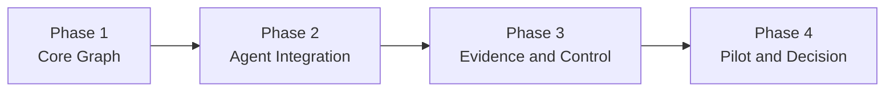

# Repository Semantic Graph 实现计划

- 状态：Implementation Plan v3（Phase 4 采用门修订）
- 更新时间：2026-07-23
- 对应设计：[REPOSITORY_SEMANTIC_GRAPH_DESIGN.md](REPOSITORY_SEMANTIC_GRAPH_DESIGN.md)
- 实现范围：Tree-sitter 多语言前端、RSG 图工具、任务/提交闭包、证据控制和 Pilot

## 当前实现状态（2026-07-23）

Phase 1–3 的实现与离线机制审计已经完成；Phase 4 已启动真实付费采用门，
但完整 Pilot 尚未运行：

| 项目 | 状态 | 证据 |
| --- | --- | --- |
| Tree-sitter pins / Python / Go grammar | 完成 | `harness/config/repo_graph_requirements.lock`，host 版本与两个 Agent Dockerfile 静态一致性测试通过 |
| language-neutral IR / manifest / schema | 完成 | `harness/featureliftbench/repo_graph/` 与两个 repo graph schema |
| Python adapter / resolver / risk cues | 完成 V1 | definition/import 差分 recall 均为 100% |
| 最小 Go portability slice | 完成 | package/function/type/interface/receiver method/import/call 使用同一 IR 和 query engine |
| JSONL store / memory index / bounded CLI | 完成 | `flb-rsg build\|bootstrap\|search\|inspect\|paths\|closure\|risks\|self-check` |
| Python-150 | 自动门通过 | 150/150 build，0 parse error，entrypoint mapping 96.73%，warm query P95 2.7ms |
| 确定性 / 路径安全 / 内存 | 自动门通过 | 5 个复建样本 digest 一致，0 absolute path leak，隔离 snapshot peak RSS 最大 167.6MB |
| 全量 harness 回归 | 通过 | 292 passed，7 skipped |
| host / Agent Docker fixture digest | 通过 | Python 3.12/macOS host 与 Python 3.11/Linux Agent image 的 implementation/snapshot/graph digest 和计数一致 |
| exact edge 分层 provenance 抽样 | 通过 | 10 个代表任务、2,167 条 population 中抽 100 条，100/100 有独立 AST/源码依据，无 unsupported exact kind |
| Phase 2 runner / cache / private overlay | 完成 | opt-in 配置、run-private materialization、fail-fast、disabled 零 prompt/file 变化 |
| 三 Agent 插拔 | 完成（离线 smoke） | OpenHands、mini-swe-agent、FeatureLiftAgent 共用字节一致 bootstrap/CLI；FeatureLift 有受限 query action |
| task closure / submission delta | 完成 V1 | exact candidate 与 uncertain risk 分离；revision 仅随内容变化；compare 输出 missing/copied/adapted/rewritten/new/forbidden |
| Phase 3 claim/evidence/freshness | 完成 V1 | append-only ledger、observed/verified 证据门、revision invalidation、detectors 与失败 probe 保留 |
| FeatureLiftAgent native guard | 完成 V1 | mutation 自动 sync、fresh final verification、stale/unresolved/pending-prune stopping blocker |
| OpenHands/mini control boundary | 明确 | 只提供 advisory tool；runner post-run audit 不冒充 online enforcement |
| Pilot controller retry 语义 | 完成 | 逻辑失败不再因 CLI 非零码重试；每个 attempt 使用独立目录 |
| OpenHands 付费 P0/P3 门控 | 停止 | clean1 完成 2/12；P3 缺 `task-closure`，停止原因 `paid_pair_rsg_adoption_gate_failed` |
| OpenHands 原生 RSG tools | 待完成 | 在新的真实 mechanism smoke 通过前不恢复剩余 10 cells |

Phase 1 checkpoint 已通过，权威审计位于 `reports/repo_graph_phase1/`。
Phase 2/3 的实现完成表示机制可运行、可审计，并不证明 RSG 能提高 Agent
成功率或降低 token。clean1 只证明 CLI prompt contract 不能稳定保证
OpenHands 采用：P3 调用了 fresh `submission-check`，但没有调用
`task-closure`。因此 Phase 4 当前停在 transport/adoption gate，不能报告
RSG correctness 或 token 的因果效应。

## 1. 总体路线

整个实现只保留四个主阶段：



| 阶段 | 回答的问题 | 可交付结果 |
| --- | --- | --- |
| Phase 1：核心图 | 能否稳定地把 Python/Go 源码转成统一、可查询的仓库骨架？ | 离线 RSG CLI |
| Phase 2：Agent 接入 | OpenHands、mini-swe-agent、FeatureLiftAgent 能否使用同一个图完成 task closure？ | 可插拔 graph profiles |
| Phase 3：证据控制 | 图能否跟踪 submission、claim、probe 和 freshness，并被 ECSM 强制使用？ | RSG-backed ECSM |
| Phase 4：实验验证 | 静态图、闭包和证据控制分别有没有真实增益？ | Pilot 报告和扩展决策 |

阶段内仍然分小提交，但不再设置十多个独立项目门槛。每个主阶段只有一个正式 checkpoint。

## 2. 冻结原则

1. Tree-sitter 是统一语法解析前端；
2. per-language query/adapter/resolver 将语言语法归一化为统一 RSG IR；
3. Tree-sitter 不被当作语义分析器，跨文件绑定和动态语义由 resolver/evidence 负责；
4. Python `ast` 只用于开发期差分审计，不写入正式 graph；
5. Phase 1 完整支持 Python，并用最小 Go adapter 验证 IR 可移植性；
6. JSONL 是权威快照，内存邻接表负责查询；
7. L1 只读取当前任务 `repo/`；TASK、metadata 和 public tests 只进入 run-local overlay；
8. hidden tests、evaluation、reference solution 和其他 run 永不进入 graph 输入；
9. OpenHands/mini 的工具增强与 FeatureLiftAgent/ECSM 的强制控制分开实验；
10. V1 不实现跨任务 L2 长期记忆、通用 MCP/HTTP 服务、图数据库和向量检索；允许使用 run-local OpenHands native-tool transport 暴露同一有界协议。

## 3. 目标代码结构

```text
harness/featureliftbench/repo_graph/
├── models.py
├── protocol.py
├── manifest.py
├── builder.py
├── closure.py
├── overlay.py
├── invalidation.py
├── query.py
├── cli.py
├── storage/
│   ├── jsonl_store.py
│   └── memory_index.py
├── parsing/
│   ├── base.py
│   ├── registry.py
│   └── tree_sitter_backend.py
└── languages/
    ├── python/
    │   ├── adapter.py
    │   ├── resolver.py
    │   ├── risks.py
    │   └── queries/*.scm
    └── go/
        ├── adapter.py
        ├── resolver.py
        └── queries/*.scm
```

Schema：

```text
harness/featureliftbench/schemas/
├── repo_graph_snapshot.schema.json
├── repo_graph_overlay.schema.json
├── repo_graph_claim.schema.json
├── repo_graph_evidence.schema.json
└── repo_graph_query_audit.schema.json
```

## 4. Phase 1：核心图与离线 CLI

### 目标

一次完成 Tree-sitter 基础设施、语言无关 IR、Python 主实现、最小 Go 验证、JSONL store 和查询 CLI。完成后即使没有 Agent，也可以对任意 benchmark `repo/` 构图和查询。

### 4.1 Parser 与依赖

- 精确 pin `tree-sitter`、`tree-sitter-python`、`tree-sitter-go`；
- 新增 `harness/config/repo_graph_requirements.lock`；
- host 与 Agent Docker 使用同一份 lock；
- `.scm` query pack 作为 package data；
- manifest 保存 core/grammar/ABI/query-pack/adapter 版本；
- 确认 Python/Go grammar、Query API 和 changed ranges 可用。

Tree-sitter 依赖只属于 harness/Agent 工具环境，不进入 task `requirements.lock`、submission 或 evaluator。

### 4.2 通用 IR

实现：

```text
GraphNode
GraphEdge
SourceSpan
Resolution
Provenance
GraphSnapshotManifest
LanguageAdapter
LanguageResolver
LanguageCapability
```

规则：

- stable ID 使用 `<language>:<namespace>:<qualified-name>:<kind>[:ordinal]`；
- stable ID 不依赖行号；
- edge resolution 只允许 exact/probable/candidate/unresolved；
- 不确定调用不能为了提高 recall 升级为 exact；
- 语言特有内容进入 `attributes`，不能增加 Python-only 通用字段；
- schema、query-pack 或 grammar 变化必须改变 snapshot identity。

### 4.3 Python Adapter

第一版提取：

- module/package/file；
- class/function/async function/method；
- import/from-import/alias/re-export；
- lexical call、attribute call、constructor candidate；
- inheritance、decorator、annotation cue；
- module-level state、mutable global、cache/singleton cue；
- environment、CWD、relative resource、package data；
- dynamic import、getattr、registry/plugin cue。

Resolver 只把无歧义 lexical/import target 标为 exact/probable；多目标或动态目标保留 candidate/unresolved。

开发期使用 Python `ast` 对 definitions、imports、entrypoints 和 call-site captures 做差分审计，但正式 graph 只使用 Tree-sitter。

### 4.4 最小 Go Adapter

只实现足以验证跨语言架构的切片：

- package；
- function/method/type/interface；
- import；
- call；
- receiver method；
- interface dispatch candidate。

本阶段不实现完整 `go/packages`、type checker 或 Go benchmark 实验。

### 4.5 Store、Index 与 CLI

实现：

```bash
python -m featureliftbench.repo_graph.cli build
python -m featureliftbench.repo_graph.cli bootstrap
python -m featureliftbench.repo_graph.cli search
python -m featureliftbench.repo_graph.cli inspect
python -m featureliftbench.repo_graph.cli paths
python -m featureliftbench.repo_graph.cli closure
python -m featureliftbench.repo_graph.cli risks
python -m featureliftbench.repo_graph.cli self-check
```

运行时索引：

```text
nodes_by_id
symbols_by_name
symbols_by_file
incoming_edges
outgoing_edges
```

输出预算：

| 查询 | 上限 |
| --- | ---: |
| bootstrap | 30 nodes / 6,000 chars |
| neighborhood/closure | 100 nodes / 12,000 chars |
| dependency paths | depth 4 / 5 paths |
| risks | 20 risks / 8,000 chars |

截断必须返回 omitted count 和 continuation token。

### Phase 1 测试

```text
test_repo_graph_models.py
test_repo_graph_store.py
test_repo_graph_tree_sitter.py
test_repo_graph_python.py
test_repo_graph_go.py
test_repo_graph_query.py
test_repo_graph_cli.py
```

新增 `harness/scripts/audit_repo_graph_python150.py` 生成离线质量和性能报告。

### Phase 1 验收门

- host 与 Agent Docker 的 fixture capture digest 一致；
- Python-150 目标 150/150 构建完成；
- 对可被 `ast` 解析的文件，class/function 和 import capture recall ≥99%；
- metadata source entrypoint exact/probable mapping ≥95%；
- 人工抽样 exact edges precision ≥95%，不足时降级为 candidate；
- Python 与 Go 使用相同 schema/query engine；
- 同一 snapshot 重建 digest 完全一致；
- 无 host absolute path 或 benchmark private path；
- warm query P95 目标 <1s，最大 snapshot RSS 目标 <256MB；
- 所有 CLI 输出遵守预算和 schema。

Phase 1 通过后再改 runner，不提前启动模型实验。

## 5. Phase 2：Agent 接入、Task Closure 与 Submission Delta

### 目标

把离线 RSG 变成 OpenHands、mini-swe-agent 和 FeatureLiftAgent 都能插拔使用的工具，并加入当前任务闭包与 submission 对照。

### 5.1 Profile 与初始化

新增配置：

```toml
repo_graph_mode = "disabled"       # disabled | static | closure | evidence
repo_graph_transport = "cli"       # cli | inprocess
repo_graph_fail_fast = true
repo_graph_bootstrap_max_nodes = 30
repo_graph_query_max_chars = 12000
```

runner 在第一次模型调用前：

1. 计算 source tree hash；
2. 命中或构建 `(source, commit, tree-hash, builder, schema)` cache；
3. 将 snapshot 物化到 `agent_output/state/repo_graph/base/`；
4. 从当前 TASK、metadata 和 public tests 创建私有 overlay；
5. 映射 entrypoints 和 included behaviors；
6. 创建 submission revision 0；
7. 自动生成固定预算 bootstrap/tool contract；
8. 执行 manifest、路径和 grammar self-check；
9. 成功后才启动 Agent。

graph mode 启用时初始化失败必须 fail-fast。`disabled` 不生成 graph 文件、不改变 prompt 和命令。

### 5.2 跨 Agent 插件

- OpenHands 和 mini-swe-agent 使用相同 CLI；
- FeatureLiftAgent 可以使用相同 protocol 的 Python API；
- CLI 默认从 `FEATURELIFTBENCH_AGENT_OUTPUT_DIR/state/repo_graph` 解析路径；
- 现有 `/flb/agent` Docker mount 足以携带 run-local graph；
- 不修改 OpenHands/mini-swe-agent 上游包；
- 三类 Agent 收到字节一致的 bootstrap 和工具说明。

### 5.3 Task Closure

- behavior nodes 来自当前 task included behaviors/output API；
- public tests 只进入当前 run overlay；
- exact dependency 形成 closure candidate；
- probable/candidate/unresolved 形成 risk；
- required/replaceable/incidental/optional/excluded 必须由 Agent claim，不由静态规则宣布；
- closure 可渲染为现有 `closure_plan.md` 和 `dependency_manifest.json`；
- closure gold 只用于离线评价，不进入 Agent graph。

### 5.4 Submission Delta

为 `submission/featurelifted` 实现：

```bash
python -m featureliftbench.repo_graph.cli sync-submission
python -m featureliftbench.repo_graph.cli compare
```

- 内容 hash 变化才递增 revision；
- 映射 copied/adapted/rewritten/new artifact；
- 比较 source/submission API、type、import、resource；
- 检测 forbidden original import 和 missing provider；
- runner 在 Agent 结束后执行只读 post-run sync/audit；
- post-run audit 不能修改 submission，也不能冒充在线 Agent 控制。

### Phase 2 Audit

每个 run 保存：

```text
repo_graph_policy.json
repo_graph_build.json
repo_graph_queries.jsonl
repo_graph_usage.json
```

记录 build/load/cache、node/edge/unresolved、query chars、truncation、entrypoint mapping、submission revision/gaps 和 protocol violation；不保存 secrets、完整源码和完整 stdout。

### Phase 2 验收门

- 三类 Agent 的 static/closure smoke 均可运行；
- disabled profile 的现有 agent/config/runner tests 无回归；
- host 与 Docker graph 路径一致可用；
- global cache 不作为跨任务可写目录暴露；
- public test 信息不会进入其他 task 或 L1；
- hidden/evaluation/reference solution 输入命中为 0；
- 相同 task/snapshot 的 closure digest 确定；
- revision 只在真实 submission 内容变化时增加；
- source/submission compare 能区分 missing、copied、adapted、rewritten、forbidden；
- graph-context chars/token 与普通文件读取分开统计。

## 6. Phase 3：Evidence、Freshness 与 ECSM 控制

### 目标

把“代码图”升级为当前 run 的证据闭包状态，同时明确区分跨 Agent advisory tool 和 FeatureLiftAgent 原生 enforcement。

### 6.1 Claim 与 Evidence

状态机：

```text
hypothesis -> observed -> verified
     |            |          |
     +------------+----------+-> contradicted
                              -> stale
```

规则：

- hypothesis 可以由 Agent 创建；
- observed 至少需要当前 revision 的一个公开 probe；
- verified 至少需要两类独立证据；
- source/submission hash、environment scope 或 revision 变化触发 stale；
- stale evidence 不能支持 closure complete 或 stopping；
- 完整 stdout 留在原 run audit，RSG 只保存摘要和 hash；
- failed probe 必须保留，避免无信息重复探索。

### 6.2 风险触发式 Probe

第一批 detector：

- API/type/export closure；
- resource/package-data；
- optional/third-party dependency；
- global mutable state/cache/singleton；
- environment/CWD/config；
- import-time registration/decorator/registry；
- dynamic import/getattr/dispatch cue；
- forbidden boundary。

Detector 只提供 source cue、risk 和 suggested probe，不默认运行全部探针，也不把 dynamic cue 当作已证实 dependency。

### 6.3 跨 Agent Advisory

OpenHands/mini-swe-agent 可以通过 CLI：

```text
claim add/update
evidence record
risks
freshness
sync-submission
compare
```

但当前 subprocess runner 不能强制它们每次 mutation 后同步或满足 stopping guard。runner 只在 post-run 做真实性审计。

### 6.4 FeatureLiftAgent / ECSM Enforcement

- 使用 in-process RSG API；
- ECSM obligation/artifact/evidence ID 与 stable ID 对齐；
- 每次 write/copy/prune 后自动 sync；
- unresolved hard closure、pending prune 和 stale final validation 阻止 finalize；
- prune 失败必须 restore 并重新验证；
- repeated query/read 未改变 state 时降低动作优先级；
- controller 重启可以从 overlay 恢复。

### Phase 3 验收门

- 无 evidence 的 claim 不能升级 observed/verified；
- mutation 后旧验证自动 stale；
- stale evidence 不能通过 native stopping guard；
- detector 输出包含 source cue 和 probe rationale；
- 低精度 detector 不暴露给 Agent；
- OpenHands/mini post-run audit 与 FeatureLiftAgent online enforcement 在报告中明确区分；
- claim/evidence 不包含 API key、完整摘要或 hidden information；
- N0/N1 除 RSG/ECSM 能力外模型、预算、工具和 evaluator 一致。

## 7. Phase 4：Smoke、Pilot 与扩展决策

### 7.1 基础设施 Smoke

每类 Agent 至少运行：

- graph disabled baseline；
- static graph；
- closure overlay；
- graph initialization failure。

验收：bootstrap 非空、query audit 可解析、预算无违反、无 private path、evaluator 正常保存、disabled 无回归。

### 7.2 Plug-in Pilot

顺序验证，避免一开始铺满全部矩阵：

当前冻结的 12-run Pilot v1 先比较 P0 与 P3 整体干预（2 tasks × 2 arms ×
3 repeats），不拆 static/bootstrap/closure 的单独贡献；P1/P2 在工具采用
稳定后再加入。2026-07-23 clean1 的第一对因 P3 未调用 `task-closure` 在
2/12 后停止。当前执行顺序冻结为：

1. 实现 OpenHands run-local native tools；
2. 新的真实 mechanism smoke 同时观察 `task-closure` 与 fresh
   `submission-check`；
3. smoke 通过后用新 experiment ID 重新从 P0/P3 paid pair 开始；
4. paid pair 与前 4 个 RSG runs 的采用门通过后，才执行剩余 cells。

| Arm | 目的 |
| --- | --- |
| P0 | 当前 baseline |
| P1 | 固定 bootstrap，控制额外初始信息 |
| P2 | P1 + static graph queries |
| P3 | P2 + task closure/submission compare |
| P4 | P3 + evidence/freshness advisory |

只在前一层通过机制门后增加下一层：

1. P0 vs P1；
2. P1 vs P2；
3. P2 vs P3；
4. P3 有效后才加入 P4。

任务按 metadata strata 预注册，覆盖 API/data-model、resource、framework、config/environment、third-party 和相对静态任务。已知失败案例只用于 mechanism smoke，不能单独支持总体结论。

### 7.3 Native Pilot

单独比较：

| Arm | 目的 |
| --- | --- |
| N0 | FeatureLiftAgent/ECSM，无 RSG |
| N1 | RSG-backed ECSM，强制 freshness/stopping |

P4 和 N1 不能合并归因。

### 7.4 主要指标

- formal/public/hidden pass；
- public-pass-hidden-fail；
- dependency/boundary/dynamic failure；
- closure requirement recall；
- repeated reads 和 graph query；
- effective probe rate；
- fresh final verification；
- verified prompt/total tokens；
- cold build、warm load、RSS、graph bytes；
- stale/incorrect memory 负迁移。

### Phase 4 扩展门

- graph initialization/leakage/protocol failure 为 0；
- graph arms 无系统性 correctness regression；
- 至少一个预注册机制指标改善；
- 改善不是单一 repo/模型驱动；
- graph-context token 和 cold/warm index cost 完整报告；
- 只扩展有证据的能力层，不自动启动 L2 长期记忆。

## 8. 统一 Stop / Rollback 规则

- Tree-sitter definition/import capture 未达门：停在 Phase 1，先修 query pack；
- exact edge precision 不足：降级 resolution，不伪造确定性；
- Go adapter 迫使 IR 出现 Python-only 字段：返回修改通用 schema；
- graph 输出导致 prompt 增长抵消读取节省：缩小 bootstrap/query budget；
- Phase 2 的 static graph 没有效率/closure 信号：不增加更多静态关系；
- task closure 没改善 dependency/boundary mechanism：重新审计 ranking，不进入 evidence；
- evidence 出现错误 claim 负迁移：关闭复用，先修 provenance/invalidation；
- 任何 hidden/evaluator/private path 命中：停止全部 graph 实验并重建 snapshot；
- disabled profile 行为变化：视为阻塞回归；
- 不因为已经投入开发成本绕过扩展门。

## 9. 推荐提交边界

四个阶段不等于四个超大提交。建议保持以下可回滚边界：

1. Tree-sitter pins + IR/schema；
2. Python/Go adapters + store/query CLI；
3. runner/cache/bootstrap；
4. task closure + submission delta；
5. evidence/freshness；
6. native ECSM；
7. Pilot audit/aggregation。

Phase 1 checkpoint 之前不修改 runner；Phase 2 checkpoint 之前不启动付费模型实验；Phase 4 扩展门之前不运行大规模多臂实验。

## 10. 立即执行

现在直接开始 Phase 1，第一批交付物是：

1. Tree-sitter Python/Go dependency lock 和 Docker compatibility test；
2. language-neutral IR、schema 和 stable ID；
3. Tree-sitter backend 和 adapter registry；
4. Python query pack/resolver；
5. 最小 Go portability fixtures；
6. JSONL store、内存 index 和离线 CLI；
7. Python-150 构图质量/性能报告。

Phase 1 完成后进行一次正式 checkpoint。通过后才进入 Agent runner 接入。
