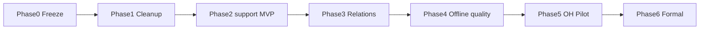

# Repository Semantic Graph 实现计划（v2）

- 状态：**Paused as primary roadmap（2026-07-24）** — Phase 1–3 已交付；提分主线让位于规格宪法
- 更新时间：2026-07-24
- 对应设计：[REPOSITORY_SEMANTIC_GRAPH_DESIGN.md](REPOSITORY_SEMANTIC_GRAPH_DESIGN.md)
- **当前研究入口：** [../CURRENT_RESEARCH.md](../CURRENT_RESEARCH.md) · [../BENCHMARK_DESIGN.md](../BENCHMARK_DESIGN.md)

> 后续若重启 RSG，目标应转向 `required_api`/behavior 清单生成，而非 Agent 文件导航。Phase 4–6 默认不排期。

## 目标

把现有偏 FeatureLift 协议的 RSG，收敛为：

1. **Repository Fact Graph**（确定性事实层）  
2. **`flb-rsg support`**（预算化 Operational Support Subgraph）  
3. OpenHands **可选** CLI：`search` / `inspect` / `support`

ECSM、claim 状态机、强制 task-closure / submission-check / stopping **不在本计划内**。

---

## 阶段总览



| 阶段 | 交付 | 通过标准 |
| --- | --- | --- |
| 0 | 基线与旧代码打标签 | 550-run / 旧 RSG 可复现 |
| 1 | 清理 OpenHands 正式路径 | 无 claim/sync/stopping/强制采用门 | **done (harness)** |
| 2 | `support` MVP | Core/Support/Boundaries + 预算；复用 closure/paths | **done (MVP)** |
| 2b | 真实 API 烟雾 | OpenHands P0/P2/D0 可跑；不因未调用工具失败 | **done 2026-07-23** |
| 3 | MVP 关系族补齐 | 预注册 10 类关系有测试 | **done (Python)** |
| 4 | 离线子图质量 | 同预算击败 k-hop / call-import（约定指标） | scaffold：`compare_support_baselines.py` |
| 5 | OpenHands Pilot | 可选工具臂可跑；采用率与效果可分报 |
| 6 | 正式实验 | Pass@1 + mean final_score + guardrail |

---

## Phase 0：冻结

- 保留 `reports/failure_attribution_20260720/`、`reports/repo_graph_phase1/`、旧 Pilot 目录。  
- 为当前 `harness/featureliftbench/repo_graph/` 打 git tag / 分支备注（由维护者执行）。  
- 文档：本设计 v2 生效；v1.1 仅历史。

## Phase 1：清理 OpenHands 路径

- 禁用 / 移除正式 profile 中的 claim、强制 sync、stopping。  
- 停用 `task-closure` 作为对外命令（或内部别名指向 `support` 调试，不写进 TASK）。  
- `submission-check` 挪到 FeatureLift audit/evaluator 脚本，不进 OpenHands 工具说明。  
- TASK 工具说明改为 optional `search|inspect|support`。  
- 配置迁移：废弃混用 `repo_graph_mode`；引入 `[rsg]` 正交字段（见设计 §9）。

**验收：** disabled 与 tool_only 烟雾测试；旧强制采用门逻辑不再阻塞 suite。

## Phase 2：`repo_support` MVP

复用现有 `closure` / `paths` / `risks` 骨架，新增：

- seed 解析（歧义返回候选）  
- support category 覆盖记账（非 Agent 义务）  
- 路径评分 \(U(p)\)（权重写入配置并冻结默认）  
- token 预算与贪心选择  
- 输出 Core / Support / Boundaries  
- CLI：`flb-rsg support --seed ... --budget-tokens ...`  
- `inspect` 字符/行预算  

**验收：** 单测 + 3–5 题手工抽查输出形态；与同预算 k-hop 有可打印 diff。

## Phase 3：关键关系

按设计 MVP 列表实现 extractor + 测试（Python 优先）：

```text
exports, provides_member, returns_type, raises,
loads_resource, packaged_by,
reads_config, default_defined_by,
registers, resolves_via
```

未解析动态边 → `resolution=unresolved_dynamic` → Boundaries。

**验收：** fixture 级精确边；Python-150 build 不回归；抽样 provenance 检查。

## Phase 4：离线子图质量

- 标注 30–50 题（seed、API、数据、配置、资源、注册、噪声、boundary）。  
- 比较：keyword、call-import、k-hop、旧 task-closure、**operational support**。  
- 同 `budget_tokens`。  
- 指标见设计 §10.1。  

**扩展门：** 至少在 API 或 resource/config/registry 一类上相对 k-hop 有约定增益，且 Noise 不显著变差，才进入 Phase 5。

## Phase 5：OpenHands Pilot

臂：

| 臂 | 说明 |
| --- | --- |
| P0 | OpenHands 纯基线 |
| P1 | + basic graph（call/import 查询） |
| P2 | + optional `support`（tool_only） |
| D0 | auto_support 注入（诊断，分报） |

任务：已找到入口、偏 C 类失败、resource/framework/data/config 切片。  
指标：Pass@1、public→hidden retention、mean final_score、extraction_ratio、copy-heavy、token、step、调用率、首次有效调用。

**Guardrail：** extraction_ratio / copy-heavy 不得系统性变差。

## Phase 6：正式实验

扩大分层任务集；冻结权重与预算；主表双指标；报告 C 类切片与总体。  
不把「工具调用率」当主成功标准。

---

## 现有资产复用

| 资产 | 用途 |
| --- | --- |
| Phase 1 离线 build / Python-150 audit | Fact Graph 基线 |
| `search` / `inspect` / `closure` / `paths` | MVP 构件 |
| runner cache / opt-in | 继续 |
| `rsg-pilot-*-clean1` | 仅证明强制采用门 fragile；不恢复 |

---

## 明确不做（本计划周期内）

- 复活 ECSM / claim 状态机  
- FeatureLiftAgent 强制 stopping 作为论文臂  
- LLM 写权威图边  
- 训练式检索 / GNN  
- 以通用 condens 为主创新  

---

## 文档同步清单

更新后应指向本计划与设计 v2：

- [../CURRENT_RESEARCH.md](../CURRENT_RESEARCH.md)  
- [../STATUS.md](../STATUS.md)  
- [README.md](README.md)  
- `harness/featureliftbench/repo_graph/README.md`  
